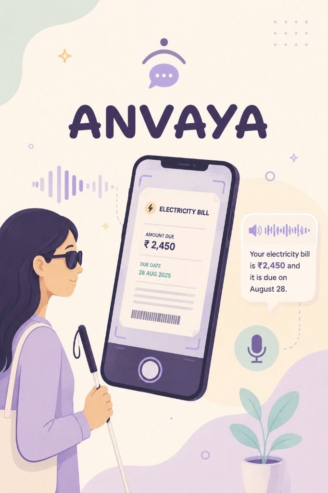

<div align="center">

# ANVAYA


**A voice-first reader for people who are blind or have low vision.**  
Point the camera at a bill or letter, ask what you need, and hear the answer.

<br />



<br />

**1. Documentation** — [DOCUMENTATION.md](DOCUMENTATION.md)  
**2. PPT** — [Pitch deck (Google Slides)](https://docs.google.com/presentation/d/1DGqHD5kImMCXFhliKshx4MAnHGbUTkPGToibX5Bqw6I/edit?slide=id.p2#slide=id.p2)  
**3. Demo video** — [Watch on Google Drive](https://drive.google.com/file/d/1AjD0TvVreUNcRiL3qPvhTajvYQxl4rgo/view?usp=share_link)  
**4. Source code** — [github.com/JBahulika/ANVAYA](https://github.com/JBahulika/ANVAYA)  
**5. Deployment** — [anvaya-ten.vercel.app](https://anvaya-ten.vercel.app)

</div>

---

## Why it exists

Most AI vision apps describe *everything* in a photo. That is noise when you cannot see the page in your hand.

ANVAYA answers in the order that matters:

1. **What is this?**
2. **How much is due?**
3. **When is the deadline?**

Built for **Prasunethon 2.0**

---

## Try it

1. Open **[anvaya-ten.vercel.app](https://anvaya-ten.vercel.app)** on Chrome.
2. Tap **Talk** and allow camera + mic.
3. Hold a bill to the camera and ask what you need.
4. Listen to ANVAYA respond — then ask a follow-up if you want.

> Needs **HTTPS** for camera/mic. Use Chrome for the best Talk experience.

---

## How it works

**Talk → Capture → LLM → Speak**

| Layer | Stack (what we actually use) |
|---|---|
| **Frontend** | **Next.js 15.2.8** (App Router) · **React 19** · **TypeScript** · browser **camera** (`getUserMedia`) · **Web Speech API** for listen + speak |
| **Backend** | **Python 3.12** · **FastAPI 0.115** · **Uvicorn** · **Pydantic 2** · Docker on **Render** |
| **LLM** | **Google Gemini 3.6 Flash** (`gemini-3.6-flash`) via the **Google GenAI API** (`google-genai` Python SDK **1.14.0**) — multimodal: image + question → spoken answer |
| **Hosting** | Frontend on **Vercel** · API on **Render** (`render.yaml` + `backend/Dockerfile`) |

Photos stay in memory only. API keys stay on the server and never go to the browser.

Full write-up: [`DOCUMENTATION.md`](DOCUMENTATION.md)

---

## Say this

| You say | ANVAYA does |
|---|---|
| “What is this?” / “Read the bill” | Reads the page out loud |
| “How much is due?” | Answers your question |
| “Simplify” | Explains in plain steps |

---

## Run locally

```bash
# Backend
cd backend && python3 -m venv .venv && source .venv/bin/activate
pip install -r requirements.txt
cp .env.example .env   # set GEMINI_API_KEY
uvicorn app.main:app --reload --port 8000

# Frontend (new terminal)
cd frontend
echo 'NEXT_PUBLIC_API_URL=http://localhost:8000' > .env.local
npm install && npm run dev
```

---

<div align="center">

**Built by [J. Bahulika](https://github.com/JBahulika)** · [Email](mailto:jbahulika@gmail.com) · [LinkedIn](https://www.linkedin.com/in/j-bahulika-8b8237207)

*Assists with reading visible text — not medical, legal, or financial advice.*

</div>
