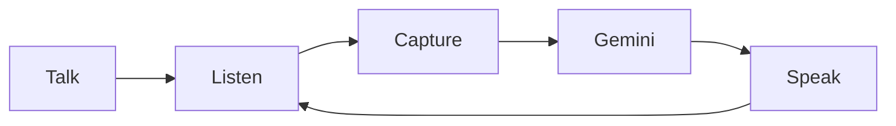

<div align="center">

# ANVAYA


**A voice-first reader for people who are blind or have low vision.**  
Point the camera at a bill or letter, ask what you need, and hear the answer.

<br />

[](https://anvaya-ten.vercel.app)
[](https://anvaya-api.onrender.com/health)

<br />


<br />


</div>

---

## Why it exists

Most AI vision apps describe *everything* in a photo. That is noise when you cannot see the page in your hand.

ANVAYA answers in the order that matters:

1. **What is this?**
2. **How much is due?**
3. **When is the deadline?**

Built for **Prasunethon 2.0** · Next.js + FastAPI + Gemini

---

## Try it (60 seconds)

1. Open **[anvaya-ten.vercel.app](https://anvaya-ten.vercel.app)** on Chrome (phone or laptop).
2. Tap **Talk** → allow camera + mic.
3. Hold a bill to the camera → say **“What is this?”**
4. Hear **amount due + due date** first.
5. Ask a follow-up (**“How much is due?”**) — same photo, no recapture.
6. Say **“Okay bye”** to end.

> Needs **HTTPS** for camera/mic. Use Chrome for the best Talk experience.

---

## How it works



| Layer | Stack |
|---|---|
| UI | Next.js · camera · Web Speech (offline voice commands) |
| API | FastAPI · rate limits · ephemeral image handling |
| AI | Google Gemini 3.6 Flash |

Photos stay in memory only. The Gemini key never leaves the server.

---

## Say this

| You say | ANVAYA does |
|---|---|
| “What is this?” / “Read the bill” | Captures and reads the page |
| “How much is due?” | Answers from the last photo |
| “Simplify” | Plain steps: first / then / finally |
| “Okay bye” | Ends the session |

---

## Run locally

```bash
# Backend
cd backend && python3 -m venv .venv && source .venv/bin/activate
pip install -r requirements.txt
cp .env.example .env   # add GEMINI_API_KEY
uvicorn app.main:app --reload --port 8000

# Frontend (new terminal)
cd frontend
echo 'NEXT_PUBLIC_API_URL=http://localhost:8000' > .env.local
npm install && npm run dev
```

Deploy notes: [`docs/DEPLOY.md`](docs/DEPLOY.md) · Security: [`docs/SECURITY.md`](docs/SECURITY.md)

---

<div align="center">

**Built by [J. Bahulika](https://github.com/JBahulika)** · [Email](mailto:jbahulika@gmail.com) · [LinkedIn](https://www.linkedin.com/in/j-bahulika-8b8237207)

*Assists with reading visible text — not medical, legal, or financial advice.*

</div>
