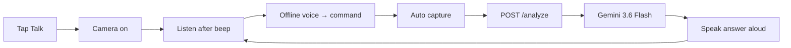

# ANVAYA

**See → Understand → Explain**

A voice-first visual assistant for people who are blind or have low vision. Point the camera at a bill, letter, or label — say what you need — and ANVAYA speaks the answer. **Amount due and deadline first.**

Built for **Prasunethon 2.0** · Multimodal accessibility · Production-deployable MVP

[](frontend)
[](backend)
[](backend/app/pipeline.py)
[](backend)
[](backend/Dockerfile)

---

## Live demo

| Link | URL |
|---|---|
| **Web app (frontend)** | `https://________________.vercel.app` |
| **API health check** | `https://________________.onrender.com/health` |
| **Source code** | [github.com/JBahulika/ANVAYA](https://github.com/JBahulika/ANVAYA) |
| **Pitch deck** | [`docs/Anvaya_Prasunethon_BEEyond.pptx`](docs/Anvaya_Prasunethon_BEEyond.pptx) |

> Camera and microphone require **HTTPS**. Use **Chrome** on a phone for the best Talk experience.

---

## The problem

Most “AI vision” apps describe **every object** in a photo. For someone who cannot see the page in their hand, that is noise.

What they need first:

- **What is this?** (utility bill, prescription label, ticket…)
- **How much is due?**
- **When is the deadline?**
- **What should I do next?**

ANVAYA is built around that order — not a dump of everything the model can see.

---

## What ANVAYA does

| You point at… | You say | You hear first |
|---|---|---|
| Electricity / water / mobile bill | “What is this?” / “Read this” | Amount due + due date |
| Credit card / EMI / insurance notice | same | Amount + deadline (+ minimum due if different) |
| Letter, form, ticket, receipt | same | What it is + the ask or time |
| Same page, denser language | “Simplify” | Plain steps: first / then / finally |
| A specific field on the last page | “How much is due?” / “How many items?” | Only that answer — reuses the saved photo |
| Done for now | “Okay bye” / “Stop” | Session ends cleanly |

Photos are processed **in memory only** and never written to disk. The Gemini API key **never** leaves the server.

---

## 90-second demo for judges

1. Open the live HTTPS URL on a phone (or laptop with webcam).
2. Tap **Talk** — allow camera + microphone.
3. Hold a **printed utility bill** to the camera.
4. After the beep, say: **“What is this?”**
5. ANVAYA captures, reads the page, and speaks **amount due + due date** in the first sentences.
6. Without moving the page, ask: **“How many items?”** — it reuses the last photo.
7. Say **“Okay bye”** — session ends.

**Fallback:** If speech recognition fails, tap **Talk** again — the camera still captures on voice command once listening starts.

---

## How it works



1. One tap unlocks mic, camera, and text-to-speech (browser gesture requirement).
2. Offline keyword matching maps speech to **Reader / Ask / Scene** agents — no extra LLM call for commands.
3. The backend sends the photo + a document playbook prompt to Gemini.
4. The answer is spoken and shown as text under **ANVAYA says**.

---

## Why this is different

| Typical vision app | ANVAYA |
|---|---|
| Lists every object | **Need-first** answers (due date before décor) |
| Text-only output | **Talk session** — speak, hear, follow up |
| One-shot | **Reuses last photo** for “how much is due?” follow-ups |
| Generic captioning | **Document playbooks** for bills, labels, tickets, forms |
| Stores uploads | **Ephemeral** — RAM only, discarded after response |
| Silent errors | **Aim hints** — “move closer”, “more light”, “hold still” |

---

## Voice commands

| Say | What happens |
|---|---|
| read this / what is this / read the bill | Capture + read page (Reader) |
| how much is due / how many items | Ask about last photo (Ask) |
| simplify / what do I do | Plain-language steps (Simplify) |
| new bill / look at this | Force fresh capture |
| repeat / say that again | Replay last answer |
| help | Spoken command list |
| okay bye / stop / goodbye | End session |

Chrome recommended. Safari speech recognition may be weaker.

---

## Architecture

```text
Phone / laptop (HTTPS)
    → Vercel (Next.js 15, React 19)
        → Render (FastAPI + Docker)
            → Google Gemini 3.6 Flash (multimodal)
```

| Layer | Technology |
|---|---|
| Frontend | Next.js App Router, Web Speech API, camera capture, document enhancement |
| Backend | FastAPI, Pydantic, in-memory rate limits, magic-byte upload validation |
| AI | Google Gemini `gemini-3.6-flash` via `google-genai` |
| Voice | Browser `SpeechRecognition` + `speechSynthesis` — keyword agents, no cloud STT |
| Hosting | Vercel (UI) + Render (API) · [`render.yaml`](render.yaml) blueprint included |

---

## Security and responsible AI

| Control | Implementation |
|---|---|
| API key | Server env only — never `NEXT_PUBLIC_*` |
| Photos | Multipart → RAM → Gemini → discarded |
| CORS | Exact origin allowlist; production **refuses boot** if missing or `*` |
| Rate limits | 10/min · 40/hr · 100/day per IP · 100/day global · 2 concurrent |
| Uploads | 8 MB max · JPEG/PNG/WebP/GIF magic-byte check |
| Production | Swagger off · generic errors · security headers on API + UI |

Full details: [`docs/SECURITY.md`](docs/SECURITY.md)

**Honest limits:** Not medical, legal, or financial advice. Not a safety system for street crossing. Hazard and prescription interpretation are out of scope.

---

## Evaluation criteria (judge map)

| Criterion | Where ANVAYA shows it |
|---|---|
| **Implementation** | Working Next.js + FastAPI + Gemini pipeline; voice session state machine; 8 unit tests |
| **Innovation** | Need-first document reader; offline voice agents; aim-hint recapture coaching |
| **Usability** | One **Talk** button; spoken feedback; large controls; okay-bye to stop |
| **Scalability** | Stateless API; ephemeral images; Docker; horizontal-scale friendly design |
| **Performance** | Gemini Flash; 8 MB cap; short spoken answers; health checks |
| **Security** | Key server-only; CORS; rate limits; upload validation; production hardening |
| **Impact** | Helps blind/low-vision users read bills, letters, and labels independently |

---

## Quick start (local)

You need two terminals and a [Gemini API key](https://aistudio.google.com/apikey).

**Terminal 1 — Backend (port 8000)**

```bash
cd backend
python3 -m venv .venv
source .venv/bin/activate          # Windows: .venv\Scripts\activate
pip install -r requirements.txt
cp .env.example .env               # set GEMINI_API_KEY + GEMINI_MODEL=gemini-3.6-flash
uvicorn app.main:app --reload --port 8000
```

**Terminal 2 — Frontend (port 3000)**

```bash
cd frontend
echo 'NEXT_PUBLIC_API_URL=http://localhost:8000' > .env.local
npm install
npm run dev
```

Open [http://localhost:3000](http://localhost:3000) · Allow camera + mic · Use Chrome.

Health check: [http://localhost:8000/health](http://localhost:8000/health) → `"gemini_configured": true`

---

## Deploy (production)

HTTPS is required for camera and microphone on a phone.

### Backend — Render

1. Push this repo to GitHub.
2. [Render](https://render.com) → **New** → **Blueprint** (uses [`render.yaml`](render.yaml)).
3. Set **`GEMINI_API_KEY`** and **`CORS_ORIGINS`** (exact Vercel URL, no trailing slash).
4. Confirm `/health` returns `"gemini_configured": true`.

### Frontend — Vercel

1. [Vercel](https://vercel.com) → Import repo → Root directory: **`frontend`**
2. Set `NEXT_PUBLIC_API_URL=https://YOUR-API.onrender.com`
3. Deploy, then update Render `CORS_ORIGINS` if the Vercel URL changed.

Full step-by-step: [`docs/DEPLOY.md`](docs/DEPLOY.md)

---

## API reference

### `GET /health`

```json
{ "status": "ok", "gemini_configured": true, "model": "gemini-3.6-flash" }
```

### `POST /analyze` · multipart

| Field | Description |
|---|---|
| `image` | JPEG / PNG / WebP / GIF (max 8 MB) |
| `mode` | `auto` · `read` · `ask` · `simplify` · `alert` · `explain` · `simple` · `detailed` |
| `question` | Optional follow-up (max 500 chars) |

```json
{
  "text": "Your electricity bill is due on 12 March. Amount due: ₹2,450.",
  "mode": "read",
  "aim_hint": "ok",
  "document_kind": "utility_bill",
  "disclaimer": "Photo is processed and not stored. Not medical, legal, or financial advice."
}
```

`aim_hint`: `ok` · `move_closer` · `more_light` · `hold_still` · `no_subject`

---

## Repository map

```text
ANVAYA/
  backend/app/       FastAPI · Gemini pipeline · rate limits · image guard
  backend/Dockerfile Render production container
  frontend/          Next.js Talk session · camera · Web Speech agents
  docs/              Deploy guide · security · pitch deck
  render.yaml        Render blueprint
```

---

## Team

**Built by J. Bahulika**

- Email: [jbahulika@gmail.com](mailto:jbahulika@gmail.com)
- [LinkedIn](https://www.linkedin.com/in/j-bahulika-8b8237207)
- [GitHub](https://github.com/JBahulika)

Contributors welcome — ANVAYA is an MVP made with care for people who deserve a calmer, trustworthy guide to the printed world.

---

## License and disclaimer

ANVAYA assists with reading visible text. It does not replace professional medical, legal, or financial advice. Always verify critical amounts and dates independently.
