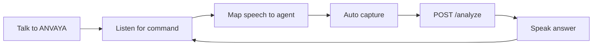

# ANVAYA

**See → Understand → Explain → Alert**

A multimodal accessibility copilot for **Prasunethon 2.0**. Point a camera at a bill, a sign, a hallway, or anything in front of you — ANVAYA turns it into clear, prioritized guidance you can **read or hear**.

[](frontend)
[](backend)
[](backend/app/pipeline.py)
[](backend)

> Pitching ANVAYA? The hackathon deck lives quietly here: **[Anvaya_Prasunethon_BEEyond.pptx](docs/Anvaya_Prasunethon_BEEyond.pptx)**

---

## What it does

Most vision apps dump every object in a photo. ANVAYA asks a different question: **what does this person actually need to know right now?**

**Voice-first:** tap **Talk to ANVAYA** once, then speak. The camera captures automatically.

| You say… | Agent | You get… |
|---|---|---|
| “Read this” | **Reader** | Amounts, dates, warnings from text — spoken first |
| “What’s in front of me” | **Scene** | Hazard, clock-face, one action |
| “Ask, what is the due date?” | **Ask** | Answer from the photo only |
| “Help” / “Stop” | — | Command list / end session |

**Capture & hear** remains the silent fallback if the mic fails. More options still expose every backend mode for demos.

Images stay in memory on the backend. They are never written to disk. The Gemini API key never leaves the server.

---

## How it works



1. Tap **Talk to ANVAYA** (browser needs one gesture for mic + camera).
2. Say **read this**, **what’s in front of me**, or **ask …**. ANVAYA maps that to Reader / Scene / Ask, captures, and speaks.
3. If the photo is dark, blurry, or off-frame, you hear how to recapture — then whatever could still be read.
4. Say **repeat**, **help**, or **stop**. Mic pauses while TTS speaks so the agent does not hear itself.

Chrome is recommended for speech recognition. Safari may be weaker on the mic.

---

## Voice agents

| Say this | Agent | Backend mode |
|---|---|---|
| read this / what does this say | Reader | `read` |
| what’s in front of me / look around / is it safe | Scene | `alert` |
| ask, … / what is … | Ask | `ask` |
| help | — | spoken command list |
| repeat | — | replay last answer |
| stop / goodbye | — | end session |

## Accessibility modes (More options)

Same photo. Different job. The voice path uses Reader / Scene / Ask. Full modes stay behind **More options** for the demo.

| Mode | When to use it |
|---|---|
| **Auto** | Documents → Read; hallways/stairs → Alert |
| **Read** | Extract / summarize visible text (amounts, dates, warnings first) |
| **Alert** | Hazard, clock-face + distance, one next action |
| **Ask** | Answer a question about the image — only from what is visible |
| **Simple** | Short answer — what it is, plus the one useful fact |
| **Detailed** | More context, still readable aloud |
| **Explain** | Help you understand a form, sign, or object |
| **Simplify** | Plain-language rewrite, step by step |

---

## Quick start

You need two terminals and a [Gemini API key](https://aistudio.google.com/apikey).

<details>
<summary><strong>1. Backend</strong> — FastAPI on port 8000</summary>

```bash
cd backend
python3 -m venv .venv
source .venv/bin/activate          # Windows: .venv\Scripts\activate
pip install -r requirements.txt
cp .env.example .env               # then set GEMINI_API_KEY
uvicorn app.main:app --reload --port 8000
```

Health check: [http://localhost:8000/health](http://localhost:8000/health)

</details>

<details>
<summary><strong>2. Frontend</strong> — Next.js on port 3000</summary>

```bash
cd frontend
echo 'NEXT_PUBLIC_API_URL=http://localhost:8000' > .env.local
npm install
npm run dev
```

Open [http://localhost:3000](http://localhost:3000). Allow camera + mic when the browser asks.

</details>

---

## 90-second demo

1. Tap **Talk to ANVAYA** → allow mic.
2. Point at a bill → say **“Read this”** → hear amount + deadline.
3. Point at stairs / a hallway (standing still) → say **“What’s in front of me”** → clock-face Alert + “This can miss things.”
4. Say **“Stop.”** Optional: More options → **Simplify** → **Hear this photo again** for plain language on the same bill.

Use **Capture & hear** if the mic fails. Chrome works best. Do not demo street crossing or a subway platform as a safety system.

---

## API

`POST /analyze` · multipart

| Field | What it is |
|---|---|
| `image` | JPEG / PNG / WebP / GIF (max **8 MB**) |
| `mode` | `auto` \| `simple` \| `detailed` \| `alert` \| `read` \| `ask` \| `explain` \| `simplify` |
| `question` | optional |

```json
{
  "text": "Your electricity bill is due on 12 March. Amount: ₹2,450.",
  "mode": "auto",
  "aim_hint": "ok",
  "aim_instruction": null,
  "confidence_note": null,
  "disclaimer": "Photo is processed and not stored. Not medical advice. Not a safety system."
}
```

`aim_hint` is `ok`, `move_closer`, `more_light`, `hold_still`, or `no_subject`.

`GET /health` reports whether `GEMINI_API_KEY` is configured.

---

## Responsible AI

- **Not medical advice.** Medicine labels are read, not interpreted as prescriptions.
- **Not a safety system.** Hazard detection can miss things — stay cautious in the real world.
- **Not for legal decisions.** Treat readings as assistance, not a guarantee.
- **Ephemeral by design.** Uploads are processed in RAM and discarded. The API key stays on the server.

---

## Repo map

```text
ANVAYA/
  backend/app/     FastAPI + Gemini pipeline (mode-specific prompts)
  frontend/        Next.js Talk session, camera, Web Speech agents
  docs/            Hackathon pitch deck
```

<details>
<summary>Stack at a glance</summary>

| Layer | Tech |
|---|---|
| Frontend | Next.js 15 (App Router), React 19, camera + Web Speech voice agents |
| Backend | FastAPI, Pydantic |
| AI | Google Gemini multimodal (`gemini-2.5-flash`), `google-genai` |
| Voice | Browser `SpeechRecognition` + `speechSynthesis` — keyword agents, no extra library |

</details>
