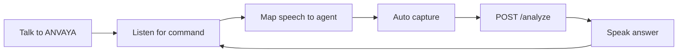

# ANVAYA

**See → Understand → Explain → Alert**

A multimodal accessibility copilot for **Prasunethon 2.0**. **First feature:** read bills and documents for people who are blind or have low vision — amount due and deadline, spoken first.

[](frontend)
[](backend)
[](backend/app/pipeline.py)
[](backend)

> **Unstop submission package:** [docs/SUBMISSION.md](docs/SUBMISSION.md) · [Document reader](docs/DOCUMENT_READER.md) · [Deploy](docs/DEPLOY.md) · [Security](docs/SECURITY.md) · [Demo video script](docs/DEMO_VIDEO_SCRIPT.md) · [PPT](docs/Anvaya_Prasunethon_BEEyond.pptx)

---

## Production submission (Unstop)

| Deliverable | Where |
|---|---|
| Source code | This repository |
| Documentation | README + [`docs/`](docs/) |
| Deployed demo | Follow [`docs/DEPLOY.md`](docs/DEPLOY.md) → Vercel + Render (HTTPS) |
| PPT | [`docs/Anvaya_Prasunethon_BEEyond.pptx`](docs/Anvaya_Prasunethon_BEEyond.pptx) · outline [`docs/PITCH_SLIDE_OUTLINE.md`](docs/PITCH_SLIDE_OUTLINE.md) |
| Demo video | Record using [`docs/DEMO_VIDEO_SCRIPT.md`](docs/DEMO_VIDEO_SCRIPT.md) |

Evaluated on implementation, innovation, usability, scalability, performance, security, and impact — mapped in [`docs/EVALUATION_CRITERIA.md`](docs/EVALUATION_CRITERIA.md).

---

## What it does

Most vision apps dump every object in a photo. ANVAYA’s first product is a **bill and document reader**: point the camera, hear what you must do.

| You point at… | You say or tap | You hear first |
|---|---|---|
| Electricity / water / mobile bill | **Read this** or **Capture & hear** | Amount due + due date |
| Credit card / EMI / insurance | same | Amount + deadline (and minimum due if different) |
| Letter, form, ticket, receipt | same | What it is + the ask or time |
| Same page, denser language | **Simplify** | First / Then / Finally |
| A specific field | **Ask, what is the amount due?** | Only that answer |

Document types and field order: [`docs/DOCUMENT_READER.md`](docs/DOCUMENT_READER.md).

**Capture & hear** is the silent fallback if the mic fails. Scene/Alert stays in More options — not the live hero.

Images stay in memory on the backend. They are never written to disk. The Gemini API key never leaves the server.

---

## How it works



1. Tap **Talk to ANVAYA** (browser needs one gesture for mic + camera).
2. Point at a bill. Say **read this** (or just tap **Capture & hear**). ANVAYA captures and speaks amount + due date first.
3. If the photo is dark, blurry, or off-frame, you hear how to recapture.
4. Say **simplify**, **ask …**, **repeat**, **help**, or **stop**.

Chrome is recommended for speech recognition. Safari may be weaker on the mic.

---

## Voice agents

| Say this | Agent | Backend mode |
|---|---|---|
| read this / read the bill / how much do I owe | Reader | `read` |
| simplify / what do I do | Simplify | `simplify` |
| ask, what is the amount due? | Ask | `ask` |
| help | — | spoken command list |
| repeat | — | replay last answer |
| stop / goodbye | — | end session |

## Accessibility modes (More options)

Same photo. Different job. The voice path uses Reader / Scene / Ask. Full modes stay behind **More options** for the demo.

| Mode | When to use it |
|---|---|
| **Auto** | Documents → Read; hallways/stairs → Alert |
| **Read** | Extract / summarize visible text (amounts, dates, warnings first) |
| **Alert** | Hazard, clock-face + distance, one next action |
| **Ask** | Answer a question about the image — only from what is visible |
| **Simple** | Short answer — what it is, plus the one useful fact |
| **Detailed** | More context, still readable aloud |
| **Explain** | Help you understand a form, sign, or object |
| **Simplify** | Plain-language rewrite, step by step |

---

## Quick start (local)

You need two terminals and a [Gemini API key](https://aistudio.google.com/apikey).

<details>
<summary><strong>1. Backend</strong> — FastAPI on port 8000</summary>

```bash
cd backend
python3 -m venv .venv
source .venv/bin/activate          # Windows: .venv\Scripts\activate
pip install -r requirements.txt
cp .env.example .env               # then set GEMINI_API_KEY
uvicorn app.main:app --reload --port 8000
```

Health check: [http://localhost:8000/health](http://localhost:8000/health)

</details>

<details>
<summary><strong>2. Frontend</strong> — Next.js on port 3000</summary>

```bash
cd frontend
echo 'NEXT_PUBLIC_API_URL=http://localhost:8000' > .env.local
npm install
npm run dev
```

Open [http://localhost:3000](http://localhost:3000). Allow camera + mic when the browser asks.

</details>

**Production deploy:** [`docs/DEPLOY.md`](docs/DEPLOY.md) (Vercel frontend + Render Docker API).

---

## 90-second demo

1. Point at a printed utility bill → **Capture & hear** (or Talk → “Read this”).
2. Hear **amount due** and **due date** in the first two seconds.
3. Same photo → say **Simplify** or More options → Simplify → Hear this photo again.
4. Optional: “Ask, is there a late fee?”

Have 2–3 real bills in the bag. If the mic fails, Capture & hear is the hero. Do not demo street crossing as a safety system.

---

## API

`POST /analyze` · multipart

| Field | What it is |
|---|---|
| `image` | JPEG / PNG / WebP / GIF (max **8 MB**) |
| `mode` | `auto` \| `simple` \| `detailed` \| `alert` \| `read` \| `ask` \| `explain` \| `simplify` |
| `question` | optional (max 500 chars) |

```json
{
  "text": "Your electricity bill is due on 12 March. Amount: ₹2,450.",
  "mode": "auto",
  "aim_hint": "ok",
  "aim_instruction": null,
  "confidence_note": null,
  "document_kind": "utility_bill",
  "disclaimer": "Photo is processed and not stored. Not medical, legal, or financial advice."
}
```

`aim_hint` is `ok`, `move_closer`, `more_light`, `hold_still`, or `no_subject`.

`GET /health` reports whether `GEMINI_API_KEY` is configured. Rate limit: 30 requests/minute/IP by default.

---

## Responsible AI & security

- **Not medical advice.** Medicine labels are read, not interpreted as prescriptions.
- **Not a safety system.** Hazard detection can miss things — stay cautious in the real world.
- **Not for legal decisions.** Treat readings as assistance, not a guarantee.
- **Ephemeral by design.** Uploads are processed in RAM and discarded. The API key stays on the server.
- **Production controls.** CORS allowlist, upload caps, rate limiting, sanitized errors when `ENVIRONMENT=production`. Details: [`docs/SECURITY.md`](docs/SECURITY.md).

---

## Repo map

```text
ANVAYA/
  backend/app/     FastAPI + Gemini pipeline, rate limit, security headers
  backend/Dockerfile
  frontend/        Next.js Talk session, camera, Web Speech agents
  docs/            Submission, deploy, security, demo script, pitch deck
  render.yaml      Render blueprint for the API
```

<details>
<summary>Stack at a glance</summary>

| Layer | Tech |
|---|---|
| Frontend | Next.js 15 (App Router), React 19, camera + Web Speech voice agents |
| Backend | FastAPI, Pydantic, Docker |
| AI | Google Gemini multimodal (`gemini-2.5-flash`), `google-genai` |
| Voice | Browser `SpeechRecognition` + `speechSynthesis` — keyword agents |
| Hosting | Vercel (UI) + Render (API) |

</details>
