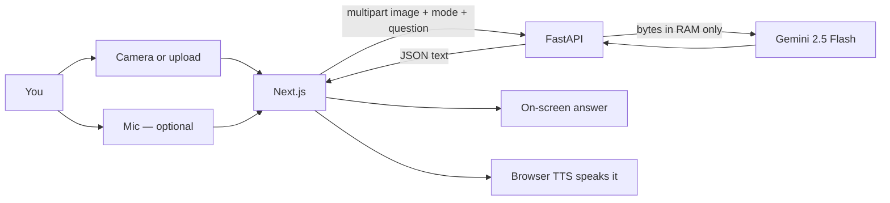

# ANVAYA

**See → Understand → Explain → Alert**

A multimodal accessibility copilot for **Prasunethon 2.0**. Point a camera at a bill, a sign, a hallway, or anything in front of you — ANVAYA turns it into clear, prioritized guidance you can **read or hear**.

[](frontend)
[](backend)
[](backend/app/pipeline.py)
[](backend)

> Pitching ANVAYA? The hackathon deck lives quietly here: **[Anvaya_Prasunethon_BEEyond.pptx](docs/Anvaya_Prasunethon_BEEyond.pptx)**

---

## What it does

Most vision apps dump every object in a photo. ANVAYA asks a different question: **what does this person actually need to know right now?**

| You point at… | You pick a mode | You get… |
|---|---|---|
| An electricity bill | **Read** | Amount due + deadline, spoken first |
| Dense form language | **Simplify** | First / then / finally |
| Stairs or a hallway | **Alert** | Hazards first — then one useful cue |
| Anything | **Ask** + Mic | An answer to *your* question |

Images stay in memory on the backend. They are never written to disk. The Gemini API key never leaves the server.

---

## How it works



1. Capture or upload a photo.
2. Choose a mode (or speak a question — ANVAYA switches to **Ask**).
3. Hit **Analyze**. FastAPI sends the image + a mode-specific prompt to Gemini.
4. The answer appears in large type **and** is spoken automatically (Chrome recommended).

---

## Seven accessibility modes

Same photo. Different job. Prompts change with the mode — this is not one generic caption.

| Mode | When to use it |
|---|---|
| **Simple** | Short answer — what it is, plus the one useful fact |
| **Detailed** | More context, still readable aloud |
| **Alert** | Hazards and urgent cues first |
| **Read** | Extract / summarize visible text (amounts, dates, warnings first) |
| **Ask** | Answer a question about the image — only from what is visible |
| **Explain** | Help you understand a form, sign, or object |
| **Simplify** | Plain-language rewrite, step by step |

---

## Quick start

You need two terminals and a [Gemini API key](https://aistudio.google.com/apikey).

<details>
<summary><strong>1. Backend</strong> — FastAPI on port 8000</summary>

```bash
cd backend
python3 -m venv .venv
source .venv/bin/activate          # Windows: .venv\Scripts\activate
pip install -r requirements.txt
cp .env.example .env               # then set GEMINI_API_KEY
uvicorn app.main:app --reload --port 8000
```

Health check: [http://localhost:8000/health](http://localhost:8000/health)

</details>

<details>
<summary><strong>2. Frontend</strong> — Next.js on port 3000</summary>

```bash
cd frontend
echo 'NEXT_PUBLIC_API_URL=http://localhost:8000' > .env.local
npm install
npm run dev
```

Open [http://localhost:3000](http://localhost:3000). Allow camera + mic when the browser asks.

</details>

---

## 90-second demo

1. **Bill** — Upload an electricity bill → **Read** → Analyze → hear amount + deadline.
2. **Plain language** — Same image → **Simplify** (or **Explain** + “What do I have to do?”).
3. **Environment** — Capture stairs / a hallway → **Alert**.
4. **Voice loop** — **Ask** → Mic → “What does this say?” → Analyze → spoken answer.

---

## API

`POST /analyze` · multipart

| Field | What it is |
|---|---|
| `image` | JPEG / PNG / WebP / GIF (max **8 MB**) |
| `mode` | `simple` \| `detailed` \| `alert` \| `read` \| `ask` \| `explain` \| `simplify` |
| `question` | optional |

```json
{
  "text": "Your electricity bill is due on 12 March. Amount: ₹2,450.",
  "mode": "read",
  "confidence_note": null,
  "disclaimer": "AI interpretations can contain errors…"
}
```

`GET /health` reports whether `GEMINI_API_KEY` is configured.

---

## Responsible AI

- **Not medical advice.** Medicine labels are read, not interpreted as prescriptions.
- **Not a safety system.** Hazard detection can miss things — stay cautious in the real world.
- **Not for legal decisions.** Treat readings as assistance, not a guarantee.
- **Ephemeral by design.** Uploads are processed in RAM and discarded. The API key stays on the server.

---

## Repo map

```text
ANVAYA/
  backend/app/     FastAPI + Gemini pipeline (mode-specific prompts)
  frontend/        Next.js camera, modes, and Web Speech loop
  docs/            Hackathon pitch deck
```

<details>
<summary>Stack at a glance</summary>

| Layer | Tech |
|---|---|
| Frontend | Next.js 15 (App Router), React 19, browser camera + Web Speech API |
| Backend | FastAPI, Pydantic |
| AI | Google Gemini multimodal (`gemini-2.5-flash`), `google-genai` |
| Voice | Browser `SpeechRecognition` + `speechSynthesis` — no extra library |

</details>
